# 🚀 Dev Portfolios – Build Your Digital Portfolio in Minutes!

[]

> 🔗 **Click the image above to view the live demo**

---

## 🧠 About the Project

A React-based digital portfolio generator that lets you create a stunning, shareable portfolio effortlessly! With multiple themes and real-time preview, just enter your details — and boom 💥 your personal site is ready!

---

## ✨ Features

- 🎯 Simple multi-step data entry
- 🎨 8 unique & colorful themes
- 🌓 Dark mode inspired sleek UI
- 📱 Fully responsive layout
- 🔄 Live preview as you type

---

## 🛠️ Built With

- React JS
- HTML + SCSS
- JavaScript
- Vercel (Deployment)

---

## 📸 Output Screenshots

> 🔽 Scroll down to see how your portfolio will look!  
> 🎉 Get inspired, pick your favorite theme, and build your own!

---

### 🧾 Form Inputs & Data Sections

| Basic Info | Skills/Projects |
|------------|------------------|
| 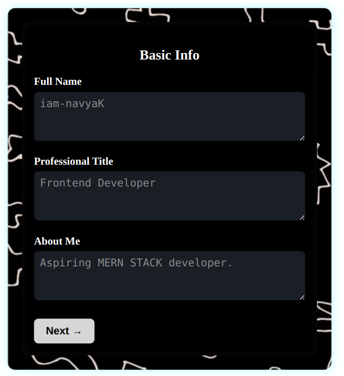 | 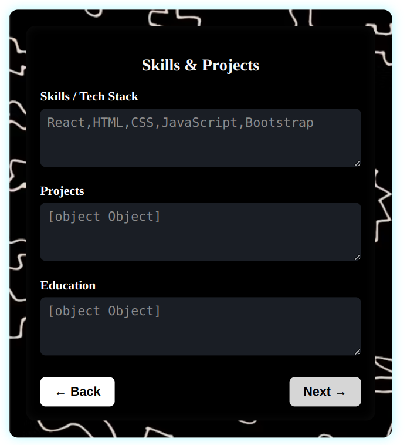 |

| Content/Personality | Certifications/Work |
|----------------------|----------------------|
| 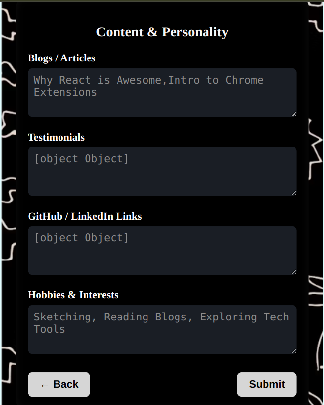 | 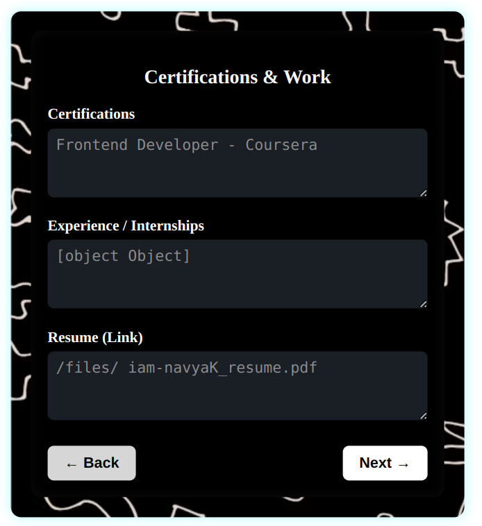 |

| Socials/Community | Theme Selection |
|------------------|------------------|
| 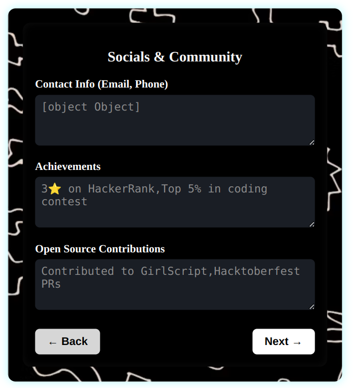 |  |

---

### 🎨 All Available Themes

| Theme 1 | Theme 2 |
|--------|--------|
| 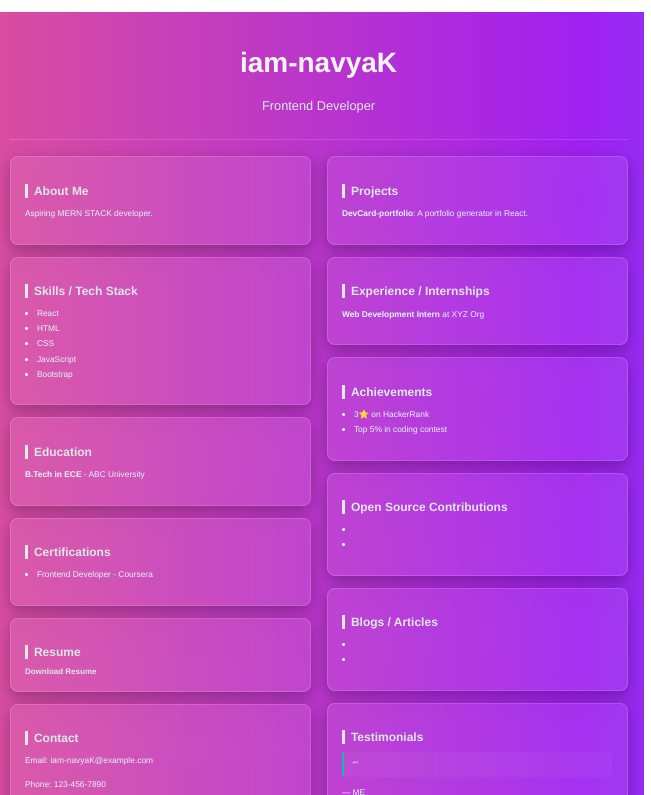 | 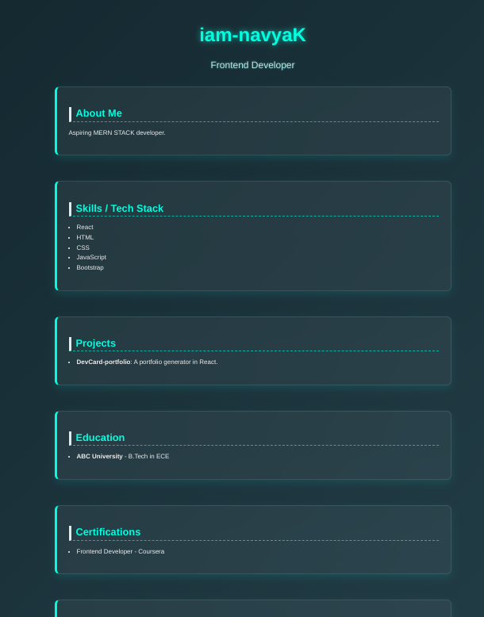 |

| Theme 3 | Theme 4 |
|--------|--------|
| 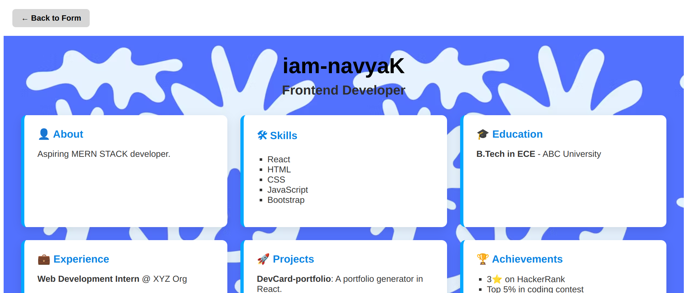 | 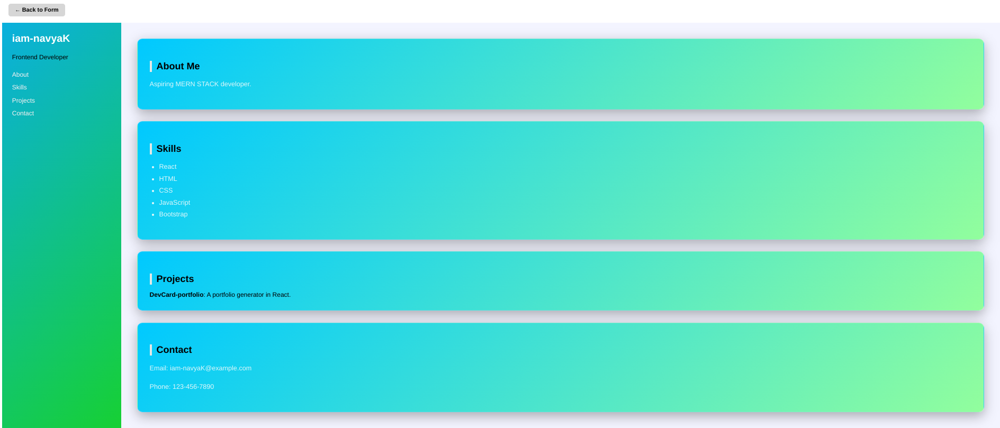 |

| Theme 5 | Theme 6 |
|--------|--------|
| 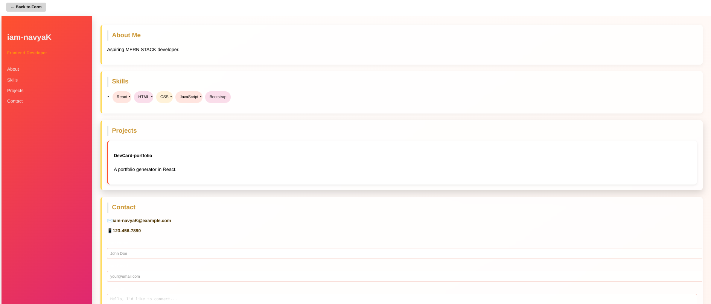 |  |

| Theme 7 | Theme 8 |
|--------|--------|
| 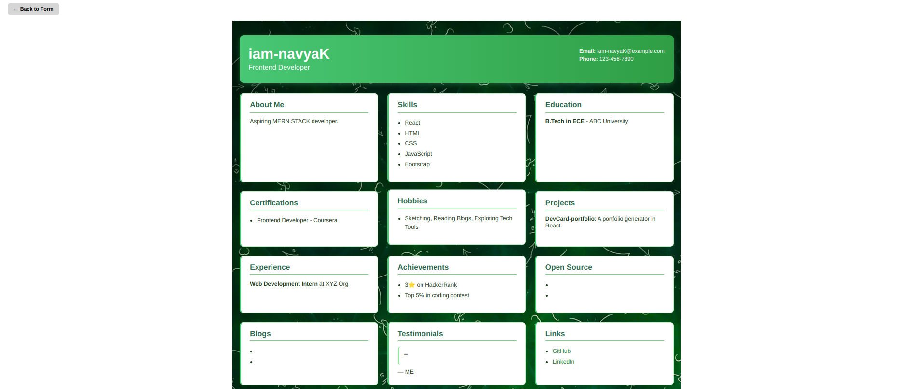 | 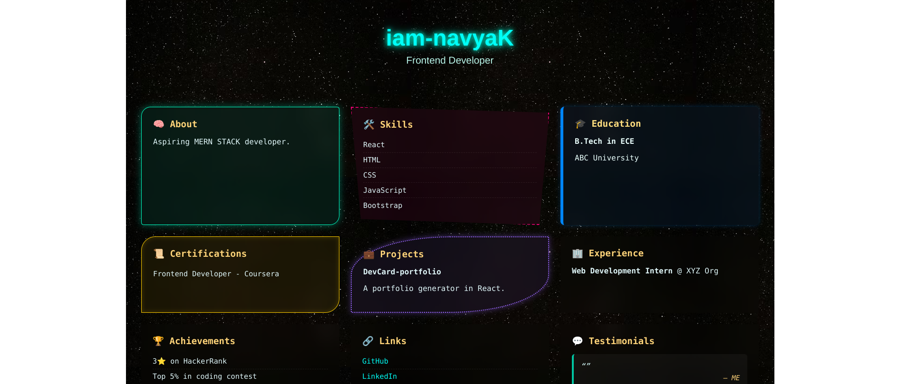 |

---

## ⭐ Like what you see?

If this project helped or inspired you:

> 👉 **Please give it a star!** It motivates me to build more cool stuff like this.

🧑‍💻 Built 💙 by [iam-navyaK](https://github.com/iam-navyaK)

---

# 1. Clone this repository
git clone https://github.com/iam-navyaK/dev-portfolios.git

# 2. Move into the project directory
cd devcard

# 3. Install dependencies
npm install

# 4. Start the development server
npm start
