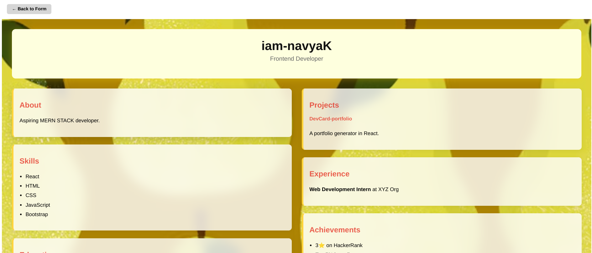

# 🚀 Dev Portfolios – Build Your Digital Portfolio in Minutes!

🔗 **[Click here to view the live demo](https://dev-portfolios-one.vercel.app)**

---

## 🧠 About the Project

A React-based digital portfolio generator that lets you create a stunning, shareable portfolio effortlessly!  
With multiple themes and real-time preview, just enter your details — and boom 💥 your personal site is ready!

---

## ✨ Features

- 🎯 Simple multi-step data entry  
- 🎨 8 unique & colorful themes  
- 🌓 Dark mode inspired sleek UI  
- 📱 Fully responsive layout  
- 🔄 Live preview as you type  

---

## 🛠️ Built With

- React JS  
- HTML + CSS + Bootstrap  
- JavaScript  
- Vercel (Deployment)  

---

## 📸 Output Screenshots

> 🔽 Scroll down to see how your portfolio will look!  
> 🎉 Enter your details and preview it instantly with amazing themes!

---

### 🧾 Form Inputs & Data Sections

<table>
  <tr>
    <td><b>Basic Info</b><br></td>
    <td><b>Skills/Projects</b><br></td>
    <td><b>Certifications/Work</b><br></td>
  </tr>
  <tr>
    <td><b>Socials/Community</b><br></td>
    <td><b>Content/Personality</b><br></td>
    <td><b>Theme Selection</b><br></td>
  </tr>
</table>

---

### 🎨 Available Portfolio Themes

| Theme 1 | Theme 2 |
|--------|--------|
|  |  |

| Theme 3 | Theme 4 |
|--------|--------|
|  |  |

| Theme 5 | Theme 6 |
|--------|--------|
|  |  |

| Theme 7 | Theme 8 |
|--------|--------|
|  |  |

---


## ⭐ Like what you see?

If this project helped or inspired you:

> 👉 **Please give it a star!** It motivates me to build more cool stuff like this.

🧑‍💻 Built with 💙 by [iam-navyaK](https://github.com/iam-navyaK)

---

## 💻 Run Locally

```bash
# 1. Clone this repository
git clone https://github.com/iam-navyaK/dev-portfolios.git

# 2. Move into the project directory
cd devcard

# 3. Install dependencies
npm install

# 4. Start the development server
npm start
